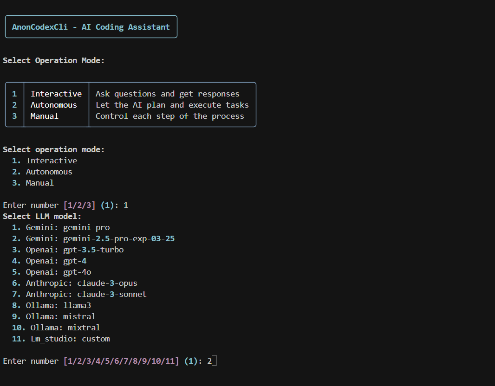

# AnonCodexCli
An interactive CLI-based AI coding assistant inspired by Cursor.


## Features

- Multiple operation modes:
  - **Interactive**: Ask questions and get responses
  - **Autonomous**: Let the AI plan and execute tasks
  - **Manual**: Control each step of the process
- Support for various LLMs:
  - Google Gemini
  - OpenAI (GPT models)
  - Anthropic Claude
  - Local LLMs via Ollama or LM Studio
- File operations and codebase understanding
- Terminal command execution
- Code search capabilities
- Interactive UI with rich terminal formatting

## Installation

See [INSTALL.md](INSTALL.md) for detailed installation instructions.

1. Clone this repository:
```bash
git clone https://github.com/AnonAmit/AnonCodexCli.git
cd AnonCodexCli
```

2. Install dependencies:
```bash
pip install -r requirements.txt
```

3. Create a `.env` file with your API keys (see `.env.example`):
```bash
cp .env.example .env
```

4. Edit the `.env` file with your actual API keys.

## Usage

Run the CLI:

```bash
python cli.py
```

This will present you with mode selection:
1. Interactive
2. Autonomous
3. Manual

### Interactive Mode

In interactive mode, you can:
- Ask coding questions
- Request file edits
- Run terminal commands through the assistant

Example:
```
> Fix the bug in app.py line 56
```

### Autonomous Mode

In autonomous mode, the assistant will:
1. Plan the execution steps
2. Execute each step
3. Test the results
4. Report progress

You can toggle whether to show code in the terminal.

### Manual Mode

In manual mode, you control each step the assistant takes.

## Supported LLM Models

AnonCodexCli supports multiple LLM providers:

### Google Gemini
- gemini-pro

### OpenAI
- gpt-3.5-turbo
- gpt-4
- gpt-4o

### Anthropic Claude
- claude-3-opus
- claude-3-sonnet

### Local LLMs
- **Ollama**: llama3, mistral, mixtral
- **LM Studio**: custom

## Model Selection

When running the CLI, you'll be prompted to select a model. You can also specify a model using the `--model` flag:

```bash
python cli.py --model gemini-pro
```

## Testing Models

You can test all supported models to verify API connections:

```bash
python test_models.py
```

## Configuration

Configure AnonCodexCli through the `.env` file:

- `DEFAULT_MODEL`: Default LLM to use
- `DEFAULT_MODE`: Default operation mode
- `MAX_TOKENS`: Maximum tokens for LLM responses
- `HISTORY_PATH`: Path to store interaction history
- `DEBUG`: Enable debug logging

## Command Line Arguments

```
usage: cli.py [-h] [--mode {interactive,autonomous,manual}] [--model MODEL] [--debug] [--query QUERY]

AnonCodexCli - A CLI-based AI coding assistant

options:
  -h, --help            show this help message and exit
  --mode {interactive,autonomous,manual}, -m {interactive,autonomous,manual}
                        Operation mode (default: interactive)
  --model MODEL         LLM model to use (default: gemini-pro)
  --debug, -d           Enable debug mode
  --query QUERY, -q QUERY
                        Query to process (if provided, runs in non-interactive mode and exits after completion)
```

## License

MIT License 
